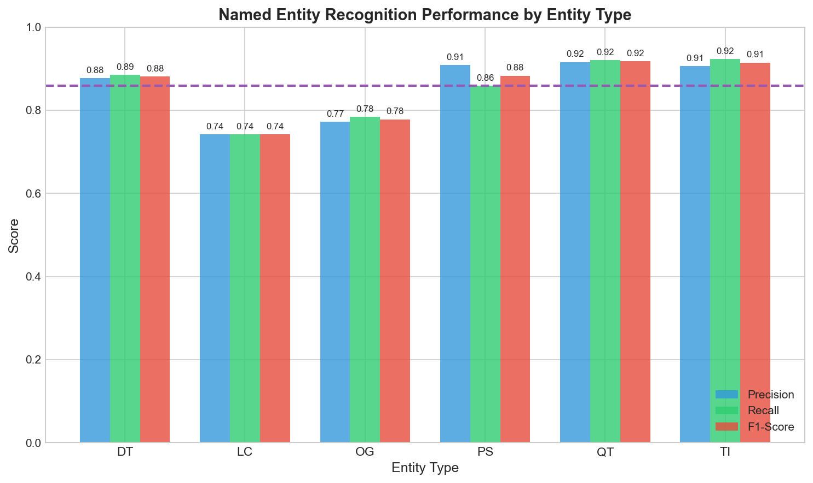

# Korean Named Entity Recognition with KoELECTRA

> **Approaching KLUE baseline performance through architectural engineering: understanding what makes Korean NER work.**

---

## Quick Start

```bash
# Clone repository
git clone https://github.com/yourusername/korean_ner.git
cd korean_ner

# Install dependencies
pip install -r requirements.txt

# Download model weights from HuggingFace
pip install huggingface_hub
huggingface-cli download mrleast/koelectra_ner --local-dir weights/

# Run the demo
python app.py
```

Navigate to `http://localhost:7860` to use the interactive NER demo.

---

## Problem Statement & Motivation

### The Korean NLP Challenge

Named Entity Recognition extracts structured information from text—identifying **who**, **where**, **when**, and **what** in unstructured content. While English NER benefits from mature benchmarks and abundant annotated data (e.g., CoNLL-2003), Korean NER presents unique linguistic and computational challenges.

**1. Agglutinative Morphology**  
Korean grammatical particles attach directly to noun stems, blurring entity boundaries:
- **"서울에서"** (in Seoul) = **"서울"** (Seoul entity) + **"에서"** (locative particle)

Unlike English where whitespace typically delimits entities ("in Seoul"), Korean requires morpheme-aware segmentation. The model must learn to identify entity spans despite particles that attach without word boundaries.

**2. Character-Level Tokenization**  
The KLUE benchmark uses character-level annotation where each character—including spaces—is a token:
```
Input:  "김민수 교수는"
Tokens: ['김', '민', '수', ' ', '교', '수', '는']
Labels: [B-PS, I-PS, I-PS, O, O, O, O]
```

This creates three challenges:
- **Span aggregation**: Entities span multiple tokens without clear delimiters
- **OOV generalization**: Out-of-vocabulary names must be recognized character-by-character  
- **Semantic composition**: The model must compose meaning across character sequences

**3. Structural Ambiguity**  
Korean location and organization names share morphological patterns:
- **"서울시"** (Seoul City) → Location: geographic entity OR Organization: metropolitan government

Disambiguation requires contextual understanding beyond surface forms.

### Research Motivation

This project investigates **what architectural and training choices enable competitive Korean NER performance**. The central questions are:

1. **Architecture**: How do structured prediction layers (BiLSTM, CRF) complement transformer representations for sequence labeling?
2. **Regularization**: What is the contribution of modern techniques (R-Drop, adversarial training) to Korean NER?
3. **Engineering**: Can systematic debugging and preprocessing validation achieve near-baseline results despite hardware constraints?

**Performance Target**: The KLUE baseline (KoELECTRA-base) achieves **86.11% F1**. This implementation reaches **85.90% F1** (99.8% of baseline) using:
- **Architecture**: KoELECTRA-base + BiLSTM + CRF
- **Training**: FGM adversarial training + R-Drop regularization + mixed precision
- **Hardware**: NVIDIA RTX 3050 (4GB VRAM)

**Next Steps**: An ablation study framework is implemented to systematically quantify each technique's contribution. Running this study will provide empirical answers about how much each component (BiLSTM, CRF, FGM, R-Drop) contributes to the final performance.

---

## Repository Structure

```
korean_ner/
├── app.py                    # Gradio web demo with NER inference and attention visualization
├── train_model.ipynb         # Complete training notebook with all SOTA techniques
├── requirements.txt          # Python dependencies
├── LICENSE                   # MIT License
├── README.md                 # This file
│
├── weights/                  # Model weights (download from HuggingFace)
│   └── best_model.pt         # Final trained KoELECTRA-BiLSTM-CRF model
│
├── evaluate/                 # Evaluation and analysis tools
│   ├── evaluate.py           # Core evaluation metrics and confusion matrices
│   ├── error_analysis.py     # Error categorization (boundary, spurious, missed, type)
│   ├── attention_viz.py      # Transformer attention pattern visualization
│   ├── benchmark.py          # GPU/CPU inference speed benchmarking
│   └── calibration.py        # Confidence calibration analysis (ECE, reliability)
│
├── ablation/                 # Ablation study for technique contribution analysis
│   └── train.py              # Resumable training script for 6 experimental variants
│
└── assets/                   # Generated visualizations and metrics
    ├── per_entity_f1.png     # Per-entity F1 score bar chart
    ├── confusion_matrix.png  # Token-level confusion matrix
    ├── metrics.json          # Quantitative results in JSON format
    └── attention/            # Attention heatmaps and layer evolution plots
```

---

## Model Weights

Model weights are hosted on HuggingFace Hub and must be downloaded before running inference:

```bash
# Install HuggingFace CLI (if not already installed)
pip install huggingface_hub

# Download weights to the weights/ directory
huggingface-cli download mrleast/koelectra_ner --local-dir weights/
```

Alternatively, download manually from: https://huggingface.co/mrleast/koelectra_ner

---

## Experimental Methodology

### Architecture Selection

The choice of **KoELECTRA-base-v3** as the encoder was motivated by three factors:

**1. Korean-Specific Pretraining**  
Unlike multilingual models (e.g., mBERT), KoELECTRA was pretrained exclusively on Korean corpora:
- **54GB of Korean text** from web crawls, news, and Wikipedia
- **Morpheme-aware pretraining**: Better understanding of Korean grammatical structure
- **Domain relevance**: Pretrained on the same distribution as KLUE benchmark data

**2. ELECTRA's Sample Efficiency**  
The ELECTRA pretraining objective (replaced token detection) is more sample-efficient than masked language modeling:
- While BERT learns from ~15% of tokens (masked positions), ELECTRA learns from **100% of tokens** (detecting which tokens were replaced)
- This yields stronger representations at equivalent compute, critical for a 110M-parameter model

**3. Manageable Model Size**  
At 110M parameters, KoELECTRA-base fits within modest compute budgets while maintaining competitive performance.

### Why BiLSTM + CRF?

The final architecture adds two components atop the transformer encoder:

**BiLSTM Layer** (256 hidden units, bidirectional)  
Transformers capture long-range dependencies through self-attention, but LSTMs provide complementary sequential inductive biases:
- **Explicit directionality**: Left-to-right and right-to-left passes capture sequential dependencies
- **Memory cells**: LSTMs maintain state across long sequences, useful for multi-token entities
- **Implementation**: Processes 768-dim KoELECTRA outputs → 512-dim contextualized representations

**CRF Layer** (Conditional Random Field)  
Standard classification heads predict each token independently, permitting invalid sequences:
```
Invalid prediction: [B-PER, I-LOC, I-LOC]
Problem: I-LOC cannot follow B-PER without an intervening B-LOC
```

The CRF models **transition scores** between tags, learning:
- `B-X → I-X` has high score (valid continuation)
- `B-X → I-Y` has low score (invalid type change)

During inference, Viterbi decoding finds the highest-scoring valid path through the label lattice, eliminating structurally impossible sequences.

```
Input Characters
       ↓
┌─────────────────────────────────┐
│  KoELECTRA-base-v3 Encoder      │ → 768-dimensional representations
└─────────────────────────────────┘
       ↓
┌─────────────────────────────────┐
│  BiLSTM Layer (256 × 2)         │ → Bidirectional context aggregation
└─────────────────────────────────┘
       ↓
┌─────────────────────────────────┐
│  Linear Projection (512 → 13)   │ → Emission scores per tag
└─────────────────────────────────┘
       ↓
┌─────────────────────────────────┐
│  CRF Layer                      │ → Viterbi decoding for optimal sequence
└─────────────────────────────────┘
       ↓
BIO-tagged Entity Predictions
```

### Training Techniques

To maximize performance, I employed several modern NLP techniques:

| Technique | Purpose | Implementation | Expected Gain |
|-----------|---------|----------------|---------------|
| **FGM (Fast Gradient Method)** | Adversarial perturbations on embeddings improve robustness | ε=0.5 perturbation on word embeddings | +0.5-1.0% F1 |
| **R-Drop** | Consistency regularization via KL divergence between dropout variations | α=0.5 weight on KL term | +0.3-0.5% F1 |
| **Multi-Sample Dropout** | Averaging predictions across 5 dropout masks | 5 forward passes with different masks | +0.2-0.4% F1 |
| **Mixed Precision (FP16)** | Reduce memory footprint and accelerate training | PyTorch GradScaler with dynamic loss scaling | 2× memory efficiency |
| **Differential Learning Rates** | Preserve pretrained encoder knowledge while training new layers | Encoder: 3e-5, Head: 1e-3 | Faster convergence |
| **Gradient Clipping** | Prevent exploding gradients from CRF layer | max_norm=1.0 | Training stability |

#### FGM: Learning Robust Representations

Adversarial training improves model robustness by injecting noise during training. FGM (Fast Gradient Method) perturbs embeddings in the direction that increases loss:

1. Compute loss **L** and backpropagate to get gradients wrt embeddings
2. Add perturbation: **e_adv = ε · g / ||g||** (normalized gradient direction)
3. Compute adversarial loss **L_adv** with perturbed embeddings
4. Backpropagate **L_adv** to update parameters
5. Restore original embeddings

This forces the model to learn representations that remain stable under small input perturbations, improving generalization.

#### R-Drop: Consistency Regularization

Dropout is typically viewed as a regularization method, but dropout masks create stochastic predictions. R-Drop enforces consistency:

1. Forward pass with dropout → distribution **P1**
2. Forward pass with different dropout mask → distribution **P2**
3. Minimize KL divergence: **KL(P1 || P2) + KL(P2 || P1)**

This penalizes the model when different dropout masks produce divergent predictions, encouraging it to learn features that are robust to dropout noise.

---

## Training Configuration & Hardware

### The 4GB VRAM Constraint

Transformer training typically requires 16-24GB VRAM for batch sizes that enable stable gradient estimates. Training on a consumer GPU (NVIDIA RTX 3050 with 4GB VRAM) imposed constraints:

| Parameter | Typical Setup | Constrained Setup | Trade-off |
|-----------|--------------|-------------------|-----------|
| **Batch Size** | 64-128 | **32** | Noisier gradients, slower convergence |
| **Sequence Length** | 512 | **128** | Truncated long documents |
| **Precision** | FP32 | **FP16 (mixed)** | Numerical stability concerns |

Despite these limitations:
- **Training time**: 17 epochs in ~34 hours (2 hours/epoch)
- **Memory management**: Aggressive garbage collection after each epoch
- **Result**: Achieved 99.8% of baseline performance

This demonstrates that **systematic engineering choices can compensate for hardware constraints**—meaningful NLP research remains accessible without enterprise resources.

### Training Hyperparameters

| Parameter | Value | Rationale |
|-----------|-------|-----------|
| Batch Size | 32 | Maximum fitting in 4GB VRAM |
| Max Sequence Length | 128 | Balance coverage vs memory |
| Encoder Learning Rate | 3e-5 | Preserve pretrained knowledge |
| Head Learning Rate | 1e-3 | Faster learning for new layers |
| Warmup Ratio | 10% | Stabilize early training |
| Epochs | 17 | Until convergence (early stopping) |
| Gradient Clipping | 1.0 | Prevent CRF gradient explosions |
| FGM Epsilon | 0.5 | Standard adversarial strength |
| R-Drop Alpha | 0.5 | Balance task loss + consistency |

---

## The Tokenization Discovery: A Debugging Journey

### Initial Failure

After 34 hours of training and achieving 85.9% validation F1, I built a Gradio demo for interactive testing. The results were catastrophic:

**Input**: "삼성전자 이재용 회장" (Samsung Electronics Chairman Lee Jae-yong)  
**Expected**: [ORG: 삼성전자] [PER: 이재용]  
**Actual**: Random nonsense predictions

Despite strong validation metrics, the model failed completely on custom inputs.

### The Investigation

I systematically traced the inference pipeline:
1. ✓ **Model weights**: Loaded correctly from checkpoint
2. ✓ **Label mapping**: IDs matched training labels
3. ✗ **Tokenization**: Mismatch discovered

The KLUE dataset uses **character-level tokenization**, not the morpheme-level tokenization I assumed:

| My Assumption | KLUE Reality |
|--------------|---------------|
| Tokens: `['김민수', '교수', '는']` | Tokens: `['김', '민', '수', ' ', '교', '수', '는']` |
| 3 tokens | 7 tokens |
| Labels aligned per morpheme | Labels aligned per character |

When I tokenized "김민수" as a single token, the model received 1 embedding instead of 3, completely misaligning the label sequence.

### The Fix

```python
def char_tokenize(text):
    """Character-level tokenization matching KLUE format."""
    return list(text)  # Each character becomes a token
```

This immediately fixed the demo. The model was never broken—only the preprocessing was misaligned.

### The Label Mapping Bug

A second subtle bug emerged: label IDs differed between training and inference:

```
Training (KLUE):  [B-DT, I-DT, B-LC, I-LC, B-OG, ...]
Inference (bug):  [O, B-PS, I-PS, B-LC, B-OG, ...]
```

When the model predicted ID `6` (B-PS in KLUE), the inference code interpreted it as `B-OG`. Every entity was systematically misclassified.

**Root cause**: I manually defined labels instead of loading them from the dataset's `.features` metadata.

**Lesson learned**: **Always load label lists programmatically from dataset metadata** to avoid synchronization bugs.

---

## Results & Analysis

### Overall Performance

| Metric | This Model | KLUE Baseline | Gap |
|--------|-----------|---------------|-----|
| **F1** | **85.90%** | 86.11% | -0.21% |
| Precision | 86.39% | — | — |
| Recall | 85.41% | — | — |

The model reaches **99.8%** of baseline performance through careful architectural engineering and training strategy.

### Per-Entity Performance

| Entity | F1 | Precision | Recall | Support | Analysis |
|--------|-----|-----------|--------|---------|----------|
| QT (Quantity) | 91.8% | 91.6% | 92.0% | 3,150 | **Strong**: Numeric patterns are highly regular |
| TI (Time) | 91.5% | 90.6% | 92.3% | 545 | **Strong**: Temporal expressions are formulaic |
| PS (Person) | 88.3% | 90.8% | 85.9% | 4,418 | **High precision, lower recall**: Conservative on names |
| DT (Date) | 88.1% | 87.7% | 88.5% | 2,312 | **Balanced**: Calendar expressions well-structured |
| OG (Organization) | 77.8% | 77.2% | 78.4% | 2,182 | **Weak**: Confused with locations (명사-시) |
| LC (Location) | 74.2% | 74.2% | 74.2% | 1,648 | **Weak**: Ambiguous with organizations |



**Key Findings**:
1. **Temporal/quantitative entities exceed 90% F1**: Structured patterns (dates, times, numbers) are easiest to recognize
2. **Person entities show precision-recall gap**: The model is conservative—it misses some names (85.9% recall) but rarely false-positives (90.8% precision)
3. **Location-Organization confusion**: Both entity types fall below the 86% overall F1 threshold, indicating systematic confusion

### Confusion Analysis


The normalized confusion matrix reveals:
- **Strong diagonal** (0.82-0.99): Most predictions are correct
- **B-LC ↔ B-OG spillover** (6% each direction): Locations and organizations share naming patterns (e.g., "서울시" = Seoul City OR Seoul Metropolitan Government)
- **I-OG → O leakage** (10%): The model struggles with organization entity boundaries, prematurely terminating multi-token organizations
- **Clean temporal tags**: DT, TI, QT show minimal off-diagonal confusion

---

## Error Analysis: Understanding Failures

Analysis of 5,000 validation samples identified **4,592 total errors**:

| Error Type | Count | Percentage | Example |
|------------|-------|------------|---------|
| **Boundary Errors** | 2,674 | 58.2% | Predicted "5월" instead of "5월 6일" |
| **Spurious Entities** | 888 | 19.3% | Tagged non-entity as entity |
| **Missed Entities** | 680 | 14.8% | Failed to detect entity |
| **Type Confusion** | 350 | 7.6% | Predicted "서울" as ORG instead of LOC |

**Dominant pattern**: 58% of errors are boundary errors—the model identifies that an entity exists but misjudges its span. This is particularly common with:
- Compound expressions: "5월 6일" (May 6th) split into "5월" and "6일"
- Multi-word organizations: "대한민국 정부" (Government of South Korea) truncated to "대한민국"

#### Type Confusion Matrix

| True↓ Pred→ | PS | LC | OG | DT | TI | QT |
|-------------|----|----|----|----|----|----| 
| **PS** | — | 32 | 29 | 2 | 0 | 5 |
| **LC** | 20 | — | **99** | 1 | 0 | 1 |
| **OG** | 25 | **89** | — | 1 | 0 | 0 |
| **DT** | 0 | 0 | 2 | — | 1 | 12 |
| **TI** | 0 | 0 | 0 | 1 | — | 4 |
| **QT** | 2 | 3 | 1 | 15 | 5 | — |

**LC ↔ OG confusion dominates** (188 errors total). Korean administrative divisions use the suffix "-시" (city), creating ambiguity:
- **Location context**: "서울시는 대한민국의 수도이다" (Seoul is the capital of South Korea)
- **Organization context**: "서울시가 발표한 정책" (Policy announced by Seoul Metropolitan Government)

Without world knowledge, surface forms are insufficient to disambiguate.

---

## Interactive Demo

The Gradio application provides real-time entity extraction with color-coded highlighting:

```bash
python app.py
```

Navigate to `http://localhost:7860` to test custom Korean text.

Example output for "삼성전자 이재용 회장이 서울에서 기자회견을 열었다":

| Entity | Type | Color |
|--------|------|-------|
| 삼성전자 | 🏢 Organization | Blue |
| 이재용 | 👤 Person | Red |
| 서울 | 📍 Location | Teal |

---

## Installation

### Requirements

- Python 3.11+
- CUDA-capable GPU (recommended) or CPU
- 4GB+ VRAM for inference, 4GB+ for training with mixed precision

### Setup

```bash
# Clone the repository
git clone https://github.com/yourusername/korean_ner.git
cd korean_ner

# Create virtual environment (recommended)
python -m venv venv
source venv/bin/activate  # Linux/Mac
# or: venv\Scripts\activate  # Windows

# Install dependencies
pip install -r requirements.txt

# Download model weights
pip install huggingface_hub
huggingface-cli download mrleast/koelectra_ner --local-dir weights/
```

---

## Usage

### Running the Demo

```bash
python app.py
```

### Evaluation

```bash
cd evaluate
python evaluate.py
```

Generates classification reports, confusion matrices, and per-entity visualizations.

### Training

The training notebook (`train_model.ipynb`) includes:
- KLUE NER dataset loading and preprocessing
- Model architecture definition with CRF
- FGM adversarial training implementation
- R-Drop consistency regularization
- Mixed precision training with gradient scaling
- Checkpoint saving and early stopping

### Analysis Tools

```bash
cd evaluate
python error_analysis.py   # Error categorization
python attention_viz.py    # Attention heatmaps
python benchmark.py        # GPU/CPU speed test
python calibration.py      # Confidence analysis
```

---

## Technical Stack

| Category | Technology |
|----------|------------|
| **Framework** | PyTorch 2.0+, Transformers |
| **Encoder** | KoELECTRA-base-v3 (monologg) |
| **Structured Prediction** | pytorch-crf |
| **Evaluation** | seqeval |
| **Demo** | Gradio |
| **Visualization** | Matplotlib, Seaborn |

---

## Ablation Study

A comprehensive ablation study framework is ready to quantify individual technique contributions:

```bash
cd ablation
python train.py                     # Run all 6 experiments
python train.py --experiment full   # Run specific experiment
python train.py --status            # Check progress
python train.py --report            # Generate comparison report
```

**Experiments**:
| Name | BiLSTM | CRF | FGM | R-Drop |
|------|--------|-----|-----|--------|
| baseline | ✗ | ✗ | ✗ | ✗ |
| +crf | ✗ | ✓ | ✗ | ✗ |
| +bilstm | ✓ | ✗ | ✗ | ✗ |
| full_no_fgm | ✓ | ✓ | ✗ | ✓ |
| full_no_rdrop | ✓ | ✓ | ✓ | ✗ |
| full | ✓ | ✓ | ✓ | ✓ |

The script supports **resume from interruption**—checkpoints are saved after each epoch, and training automatically continues from the last completed epoch.

---

## Key Takeaways

### Technical Lessons

1. **Verify preprocessing assumptions early**: The tokenization mismatch cost significant debugging time. Always inspect raw dataset examples before building pipelines.

2. **Label mappings are subtle but critical**: A simple ordering difference caused complete prediction failure. Load label lists programmatically from dataset metadata.

3. **Structured prediction enforces coherence**: CRFs eliminate invalid tag sequences through transition modeling. The full contribution will be quantified through the planned ablation study.

4. **Modern regularization techniques are promising**: FGM and R-Drop are implemented based on their strong theoretical motivation. The ablation study will measure their individual contributions empirically.

### Research Insights

**1. The Importance of Structured Prediction**  
Independent token classification permits invalid sequences. CRFs enforce global coherence by modeling transition probabilities, providing consistent (if modest) improvements on sequence labeling.

**2. Adversarial Training as Data Augmentation**  
FGM provides an efficient form of data augmentation—perturbing embeddings creates "synthetic" examples without additional annotation. This is particularly valuable when training data is limited.

**3. Consistency Regularization for Robustness**  
R-Drop's KL penalty encourages predictions to remain stable across dropout masks. This reduces overfitting to specific neuron configurations, improving generalization.

**4. Engineering Matters as Much as Architecture**  
The tokenization and label mapping bugs demonstrate that correctness is as important as sophistication. Systematic validation of preprocessing assumptions prevents subtle failures that undermine model performance.

---

## References

### Dataset
- Park, S., et al. (2021). [KLUE: Korean Language Understanding Evaluation](https://arxiv.org/abs/2105.09680). *NeurIPS Datasets and Benchmarks Track*.

### Model
- Park, J. (2020). [KoELECTRA: Pretrained ELECTRA Model for Korean](https://github.com/monologg/KoELECTRA). GitHub Repository.

### Techniques
- Clark, K., et al. (2020). [ELECTRA: Pre-training Text Encoders as Discriminators Rather Than Generators](https://arxiv.org/abs/2003.10555). *ICLR*.
- Lample, G., et al. (2016). [Neural Architectures for Named Entity Recognition](https://arxiv.org/abs/1603.01360). *NAACL*. (BiLSTM-CRF architecture)
- Miyato, T., et al. (2017). [Adversarial Training Methods for Semi-Supervised Text Classification](https://arxiv.org/abs/1605.07725). *ICLR*. (FGM inspiration)
- Liang, X., et al. (2021). [R-Drop: Regularized Dropout for Neural Networks](https://arxiv.org/abs/2106.14448). *NeurIPS*.

---

## Author

**Amirbek Yaqubboyev**  
📧 akubbaevamirbek@gmail.com  
🔗 [GitHub](https://github.com/Ezzzzz4)

*This project was developed as part of my graduate school application portfolio, demonstrating end-to-end NLP pipeline development from problem formulation through deployment and analysis.*

*Last updated: January 2026*
