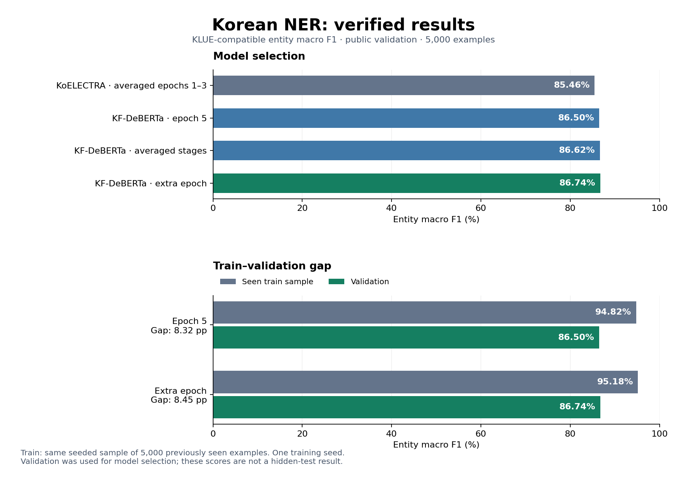
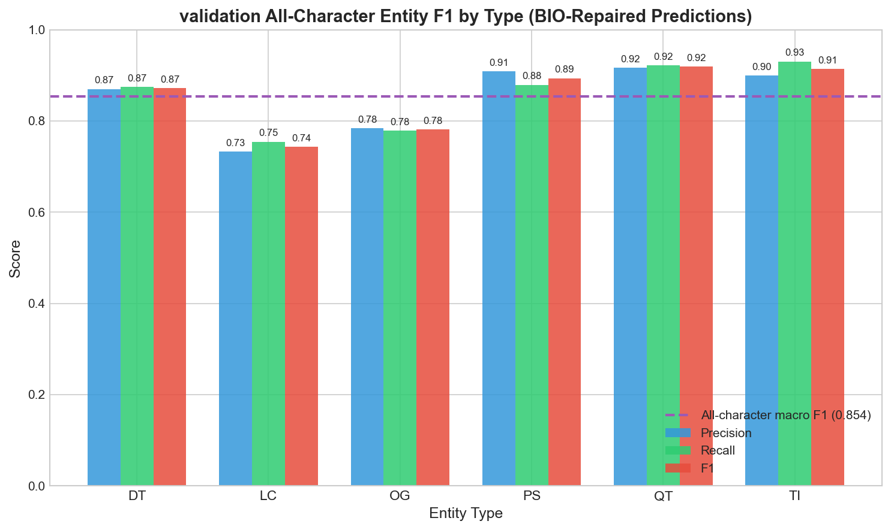
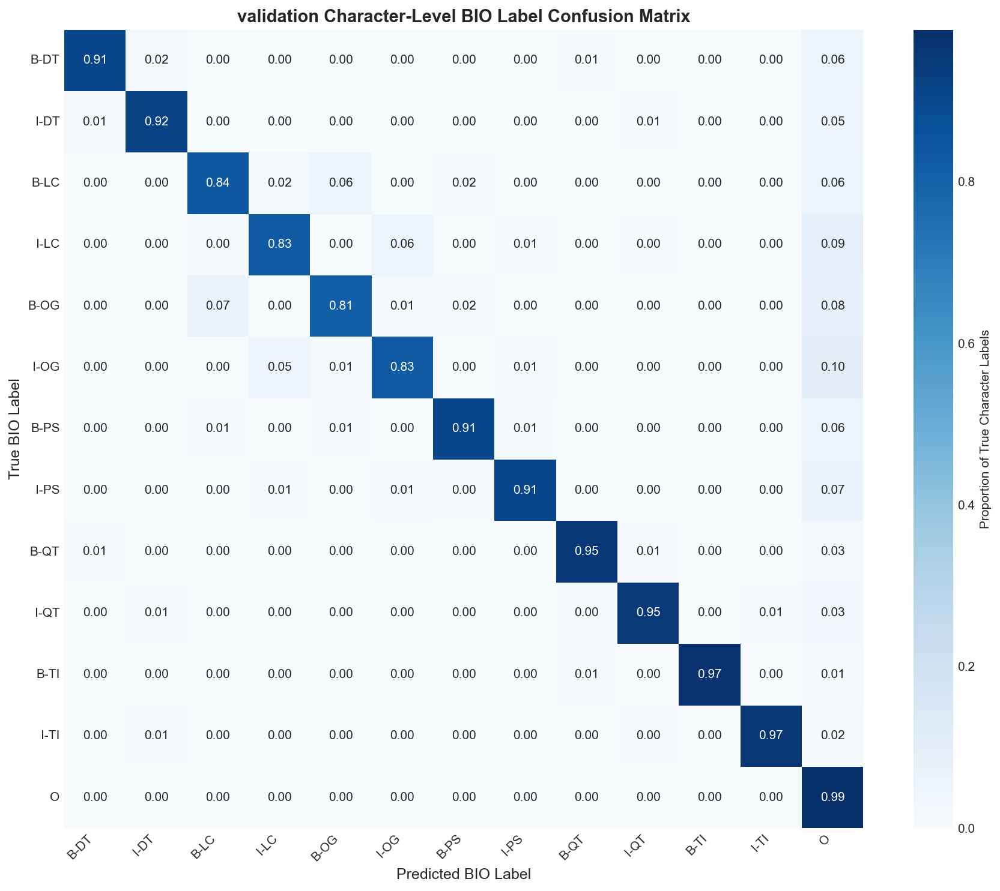

# Korean Named Entity Recognition with KoELECTRA & KF-DeBERTa

> **Understanding what makes Korean NER work: from architectural engineering and tokenization debugging to 86.74% validation entity macro F1.**

---

## Quick Start

```powershell
# Windows: clone repository and activate the new environment
git clone https://github.com/Ezzzzz4/korean_ner.git
cd korean_ner
python -m venv .venv
.\.venv\Scripts\Activate.ps1
python -m pip install -r requirements.txt

# Download the selected checkpoint; weights are kept outside Git
huggingface-cli download mrleast/kf-deberta-klue-ner best_model.pt --local-dir runs/ --local-dir-use-symlinks False
Move-Item runs/best_model.pt runs/kf_deberta_best.pt
python app_deberta.py
```

Navigate to `http://localhost:7861` to test the selected KF-DeBERTa model. The original KoELECTRA demo remains available through `python app.py` on port 7860.

**Fresh clone?** The fine-tuned weights are published separately and are not included in Git. Follow [Model Weights](#model-weights) for the download or [Training](#training) to reproduce a checkpoint. Both demos default to CPU; CUDA is selected explicitly.

---

## Problem Statement & Motivation

### The Korean NLP Challenge

Named Entity Recognition extracts structured information from text—identifying **who**, **where**, **when**, and **what** in unstructured content. While English NER benefits from mature benchmarks and abundant annotated data (e.g., CoNLL-2003), Korean NER presents unique linguistic and computational challenges.

**1. Agglutinative Morphology**  
Korean grammatical particles attach directly to noun stems, blurring entity boundaries:
- **"서울에서"** (in Seoul) = **"서울"** (Seoul entity) + **"에서"** (locative particle)

Unlike English where whitespace typically delimits entities ("in Seoul"), Korean entity boundaries often occur inside whitespace-separated words. The model must learn to identify entity spans despite particles that attach without word boundaries.

**2. Character-Level Annotation**

The KLUE source data uses character-level annotation, including spaces. Encoder tokens still depend on the model tokenizer:
```
Input:  "김민수 교수는"
Tokens: ['김', '민', '수', ' ', '교', '수', '는']
Labels: [B-PS, I-PS, I-PS, O, O, O, O]
```

This creates three challenges:
- **Span aggregation**: Entities span multiple tokens without clear delimiters
- **OOV generalization**: Out-of-vocabulary names must be recognized character-by-character  
- **Semantic composition**: The model must compose meaning across character sequences

**3. Structural Ambiguity**  
Korean location and organization names share morphological patterns:
- **"서울시"** (Seoul City) → Location: geographic entity OR Organization: metropolitan government

Disambiguation requires contextual understanding beyond surface forms.

### Research Motivation

This project investigates **what architectural and training choices enable competitive Korean NER performance**. The central questions are:

1. **Architecture**: How do structured prediction layers (BiLSTM, CRF) complement transformer representations for sequence labeling?
2. **Regularization**: What is the contribution of modern techniques (R-Drop, adversarial training) to Korean NER?
3. **Engineering**: Can systematic debugging and preprocessing validation achieve near-baseline results despite hardware constraints?

**Performance Target**: The KLUE paper reports **86.11% entity macro F1 on hidden test** for KoELECTRA-base. The selected KF-DeBERTa checkpoint reaches **86.74% on public validation** after reloading the saved weights and evaluating all 5,000 examples. This exceeds the paper's number numerically; the different splits prevent a claim of hidden-test superiority.

- **Original architecture**: KoELECTRA-base + BiLSTM + CRF
- **Selected model**: KF-DeBERTa-base + token-classification head
- **Evaluation**: Character reconstruction and KLUE-compatible strict IOB2 entity macro F1
- **Evidence**: [Saved reports and checkpoint hashes](reports/README.md), with a detailed [audit in Russian](AUDIT_RU.md)

**Next Steps**: Repeat across seeds and obtain an untouched test evaluation. The regularization ablation framework is available, but separate gains from BiLSTM, CRF, FGM, or R-Drop have not been established.

---

## Repository Structure

```text
korean_ner/
├── app.py                    # KoELECTRA demo: highlighting and attention
├── app_deberta.py            # KF-DeBERTa demo: entity spans and offsets
├── train.py                  # Corrected KoELECTRA + BiLSTM + CRF training
├── train_deberta.py          # KF-DeBERTa training and continuation
├── evaluate_deberta.py       # Reload checkpoint and evaluate a data split
├── predict_deberta.py        # Entity extraction as JSON
├── average_deberta.py        # Compatible checkpoint weight averaging
├── train_model.ipynb         # Runbook for the maintained training scripts
├── requirements.txt          # Pinned Python dependencies
├── LICENSE                   # MIT License
├── README.md                 # This file
├── AUDIT_RU.md               # Findings, corrections, and result limitations
│
├── korean_ner/               # Shared labels, alignment, decoding, and metrics
├── tests/                    # CPU regression tests
├── reports/                  # Portable evaluation snapshots and run settings
├── runs/                     # Local experiments and weights (ignored by Git)
├── weights/                  # Historical downloaded checkpoint (ignored)
│
├── evaluate/
│   ├── evaluate.py           # KoELECTRA metrics and confusion matrices
│   ├── error_analysis.py     # One-to-one pairing of entity errors
│   ├── attention_viz.py      # Descriptive transformer attention plots
│   ├── benchmark.py          # Explicit CPU/GPU inference benchmarking
│   ├── calibration.py        # Emission-classifier calibration diagnostics
│   └── report_results.py     # Rebuild README chart from saved reports
│
├── ablation/train.py         # Four regularization variants, same architecture
└── assets/                   # Current figures and labeled historical artifacts
```

---

## Model Weights

The selected model and rollback checkpoint are stored locally:

| Checkpoint | Model | Validation entity macro F1 |
|------------|-------|---------------------------|
| `runs/kf_deberta_best.pt` | KF-DeBERTa, one extra epoch at 5e-6 | **86.74%** |
| `runs/kf_deberta_epoch5.pt` | KF-DeBERTa, epoch 5 | 86.50% |
| `runs/corrected_seed42/averaged_e1_e2_e3.pt` | Corrected KoELECTRA, averaged epochs 1–3 | 85.46% |

Each KF-DeBERTa checkpoint is approximately 707 MiB. These files are excluded from Git; their SHA-256 hashes are recorded in [reports](reports/README.md). After a fresh clone, download the selected fine-tuned checkpoint or run the [training procedure](#training). The public [KF-DeBERTa-base encoder](https://huggingface.co/kakaobank/kf-deberta-base) is pretrained, so downloading it alone does not reproduce the NER result.

The selected weights are published at [mrleast/kf-deberta-klue-ner](https://huggingface.co/mrleast/kf-deberta-klue-ner). `best_model.pt` is the checkpoint used by this repository; `model.safetensors`, `config.json`, and tokenizer files support standard Transformers loading. The epoch-5 rollback checkpoint remains local.

The **historical KoELECTRA weights** remain available on [Hugging Face](https://huggingface.co/mrleast/koelectra_ner):

```bash
huggingface-cli download mrleast/koelectra_ner best_model.pt --local-dir weights/
```

These historical weights used a different space representation. They can be inspected with the current evaluator, but that run is a distribution-shift diagnostic and does not reproduce their original score.

---

## Experimental Methodology

### Architecture Selection

The original model uses **KoELECTRA-base-v3**, a Korean pretrained encoder, with BiLSTM and CRF layers for sequence labeling. This provides a concrete setting for investigating alignment, contextual representations, and tag transitions.

The follow-up experiment uses **KF-DeBERTa-base** with a token-classification head. It starts from the public encoder at revision `363b171d71443b0874b0bf9cea053eb5b1650633` and learns the NER head on KLUE training data. Subword offsets map predictions back to original characters.

**Selected configuration**: The 86.74% KF-DeBERTa run uses a token-classification head without BiLSTM, CRF, FGM, or R-Drop. Those components belong to the separate KoELECTRA experiments described below.

**Why keep both?** The corrected KoELECTRA pipeline preserves the original experiment, while KF-DeBERTa provides a separately trained comparison. Changing the encoder and head together means the result cannot isolate the contribution of one architectural component.

### Why BiLSTM + CRF?

The original architecture adds two components atop the transformer encoder:

**BiLSTM Layer** (256 hidden units, bidirectional)  
Transformers capture long-range dependencies through self-attention, but LSTMs provide complementary sequential inductive biases:
- **Explicit directionality**: Left-to-right and right-to-left passes capture sequential dependencies
- **Memory cells**: LSTMs maintain state across long sequences, useful for multi-token entities
- **Implementation**: Processes 768-dim KoELECTRA outputs → 512-dim contextualized representations

**CRF Layer** (Conditional Random Field)  
Standard classification heads predict each token independently, permitting invalid sequences:
```
Invalid prediction: [B-PER, I-LOC, I-LOC]
Problem: I-LOC cannot follow B-PER without an intervening B-LOC
```

The CRF models **transition scores** between tags and can learn to prefer:
- `B-X → I-X` has high score (valid continuation)
- `B-X → I-Y` has low score (invalid type change)

During inference, Viterbi decoding finds the highest-scoring path under the learned scores. This implementation does **not** impose hard BIO constraints, so invalid transitions remain possible. Benchmark scoring uses raw predictions; BIO repair is reserved for display and explicitly labeled diagnostics.

```
Input Characters
       ↓
┌─────────────────────────────────┐
│  KoELECTRA-base-v3 Encoder      │ → 768-dimensional representations
└─────────────────────────────────┘
       ↓
┌─────────────────────────────────┐
│  BiLSTM Layer (256 × 2)         │ → Bidirectional context aggregation
└─────────────────────────────────┘
       ↓
┌─────────────────────────────────┐
│  Linear Projection (512 → 13)   │ → Emission scores per tag
└─────────────────────────────────┘
       ↓
┌─────────────────────────────────┐
│  CRF Layer                      │ → Viterbi decoding for optimal sequence
└─────────────────────────────────┘
       ↓
BIO-tagged Entity Predictions
```

### Training Techniques

The project explores several NLP training techniques. Their implementation and measured status are kept explicit:

| Technique | Purpose | Implementation | Evidence in this project |
|-----------|---------|----------------|--------------------------|
| **FGM (Fast Gradient Method)** | Perturb embeddings during training | Optional `--use-fgm`, default ε=0.5 | KoELECTRA option; separate gain unmeasured |
| **R-Drop** | Encourage agreement between dropout passes | Optional `--use-rdrop`, default α=1.0 | KoELECTRA option; separate gain unmeasured |
| **Mixed Precision (BF16)** | Reduce GPU memory use during training | Explicit `--device cuda --bf16` | Used in the reported KF-DeBERTa run |
| **Differential Learning Rates** | Train encoder and new layers at different rates | KoELECTRA encoder/head parameter groups | Available; selected KF-DeBERTa uses one rate |
| **Gradient Clipping** | Limit gradient norm | max_norm=1.0 | Used in the reported run |
| **Checkpoint Averaging** | Compare nearby model weights | Equal-weight parameter average | KF-DeBERTa average: 86.62%, below selected 86.74% |

The original README's numerical gains for FGM, R-Drop, and multi-sample dropout were not supported by completed ablations. Those estimates have been removed.

#### FGM: Learning Robust Representations

Adversarial training improves model robustness by injecting noise during training. FGM (Fast Gradient Method) perturbs embeddings in the direction that increases loss:

1. Compute loss **L** and backpropagate to get gradients wrt embeddings
2. Add perturbation: **e_adv = ε · g / ||g||** (normalized gradient direction)
3. Compute adversarial loss **L_adv** with perturbed embeddings
4. Backpropagate **L_adv** to update parameters
5. Restore original embeddings

This encourages stability under small embedding perturbations. Whether it improves this task must be measured with matched training runs.

#### R-Drop: Consistency Regularization

Dropout is typically viewed as a regularization method, but dropout masks create stochastic predictions. R-Drop enforces consistency:

1. Forward pass with dropout → distribution **P1**
2. Forward pass with different dropout mask → distribution **P2**
3. Minimize KL divergence: **KL(P1 || P2) + KL(P2 || P1)**

This penalizes the model when different dropout masks produce divergent predictions, encouraging it to learn features that are robust to dropout noise.

---

## Training Configuration & Hardware

### From Hardware Constraints to a Verified Run

The original project emphasized training under a 4GB VRAM constraint. The newly verified experiment ran on an **NVIDIA RTX 5090 Laptop GPU** with BF16. The earlier 17-epoch / 34-hour / FP16 account does not establish the resource requirements or performance of this new run.

All scripts default to CPU and require explicit CUDA selection. Sequence overflow raises an error instead of silently dropping text. The longest observed KF-DeBERTa inputs were 103 training tokens and 83 validation tokens, within the 128-token limit.

### Training Hyperparameters

| Parameter | Initial Run | Extra Epoch | Rationale |
|-----------|-------------|-------------|-----------|
| Training examples | 21,008 | Same training split | Full KLUE training data |
| Validation examples | 5,000 | Same validation split | Checkpoint selection |
| Train / evaluation batch size | 16 / 32 | 16 / 32 | Dynamic padding |
| Max sequence length | 128 | 128 | No truncation in these splits |
| Learning rate | 3e-5 | 5e-6 | Smaller final adjustment |
| Warmup ratio | 10% | 0% | Fresh optimizer schedule for continuation |
| Weight decay | 0.01 | 0.01 | Same regularization setting |
| Epochs | 5 | 1 | Stop after the extra validation comparison |
| Gradient clipping | 1.0 | 1.0 | Bound gradient norm |
| Precision | BF16 autocast | BF16 autocast | Reloaded evaluation uses FP32 |
| Random seed | 42 | 42 | One seed, not a multi-seed study |

**Checkpoint selection** uses KLUE-compatible validation entity macro F1. The original five-epoch checkpoint is retained for rollback. Full settings are saved in [the training manifest](reports/kf_deberta_training.json).

---

## The Tokenization Discovery: A Debugging Journey

### Initial Failure

The original README described a debugging problem: a reported 85.9% validation F1 did not translate into useful predictions in the Gradio demo:

**Input**: "삼성전자 이재용 회장" (Samsung Electronics Chairman Lee Jae-yong)  
**Expected**: [ORG: 삼성전자] [PER: 이재용]  
**Actual**: Random nonsense predictions

This was the original project narrative; the saved evaluation reports do not independently verify those particular custom-input failures.

### The Investigation

My original debugging account traced the inference pipeline:
1. ✓ **Model weights**: Loaded correctly from checkpoint
2. ✓ **Label mapping**: IDs matched training labels
3. ✗ **Tokenization**: Mismatch discovered

The KLUE dataset supplies **character-level labels**. I had assumed word-level alignment would transfer directly to inference:

| My Assumption | KLUE Reality |
|--------------|---------------|
| Tokens: `['김민수', '교수', '는']` | Tokens: `['김', '민', '수', ' ', '교', '수', '는']` |
| 3 tokens | 7 tokens |
| Labels aligned per morpheme | Labels aligned per character |

Changing how "김민수" is tokenized changes the number and positions of model tokens. Labels need an explicit mapping to those positions.

### The Fix

The first debugging step was to inspect `list(text)`. A later audit showed that this alone was insufficient: a tokenizer can still drop spaces or produce multiple subpieces for one character.

```python
from korean_ner import align_text

def char_tokenize(text, tokenizer):
    """Preserve character positions in the corrected KoELECTRA pipeline."""
    return align_text(text, tokenizer, max_length=192)
```

The corrected KoELECTRA alignment inserts the existing vocabulary **ID** for `[unused0]` at whitespace positions. Passing the literal string through the tokenizer would split it into several pieces. KF-DeBERTa instead tokenizes full text and retains offset mappings; the demo restores internal spaces when an entity continues across them.

**The scoring detail**: KLUE annotates spaces, but the official baseline removes ordinary space labels when computing its benchmark metric. The evaluator therefore reports benchmark-compatible scores separately from all-character diagnostics. It reconstructs characters before computing strict IOB2 **macro** F1. The old 85.90% subtoken **micro** F1 measured a different quantity.

### The Label Mapping Bug

A second subtle bug emerged: label IDs differed between training and inference:

```
Training (KLUE):  [B-DT, I-DT, B-LC, I-LC, B-OG, ...]
Inference (bug):  [O, B-PS, I-PS, B-LC, B-OG, ...]
```

For example, ID `6` is `B-PS` in the KLUE mapping. A manually reordered label list can assign that ID to a different entity type, even when model weights load correctly.

**Root cause**: I manually defined labels instead of loading them from the dataset's `.features` metadata.

**Lesson learned**: **Always load label lists programmatically from dataset metadata** to avoid synchronization bugs.

---

## Results & Analysis

### Overall Performance

All four project rows below use the **same 5,000-example public validation split** and KLUE-compatible strict IOB2 entity macro F1. KF-DeBERTa scores were confirmed by loading the saved weights in a separate FP32 evaluation process.

| Model | Validation Entity Macro F1 | Decision |
|-------|---------------------------|----------|
| Corrected KoELECTRA + BiLSTM + CRF, averaged epochs 1–3 | 85.46% | Retained original architecture |
| KF-DeBERTa-base, epoch 5 | 86.50% | Saved rollback checkpoint |
| KF-DeBERTa-base, average of epoch 5 and extra epoch | 86.62% | Below the selected checkpoint |
| **KF-DeBERTa-base, extra epoch at 5e-6** | **86.74%** | **Selected model** |

**Reference, not a matched test comparison**: the [official KLUE baseline](https://github.com/KLUE-benchmark/KLUE-baseline) reports 86.06% for KoELECTRA-base on validation; the [KLUE paper](https://arxiv.org/abs/2105.09680) reports 86.11% on hidden test. The historical project score, 85.90%, was subtoken micro F1. These numbers should not be pooled into one performance ranking.



**Key Findings**:
1. **The extra epoch improved validation by 0.24 percentage points**: 86.50% → 86.74%. It used a smaller learning rate and a fresh optimizer schedule.
2. **Weight averaging did not win this comparison**: 86.62% was retained in the report, but the extra-epoch checkpoint was selected.
3. **The new model is numerically above 86.11%**: hidden-test superiority remains unverified. The encoder and head changed together, so no single component receives credit for the improvement.

### Overfitting Check

| Checkpoint | Seen Train Sample F1 | Validation F1 | Train–Validation Gap |
|------------|----------------------|---------------|---------------------|
| Epoch 5 | 94.82% | 86.50% | 8.32 pp |
| Extra epoch | 95.18% | 86.74% | 8.45 pp |

Both training measurements use the **same randomly selected 5,000 previously seen examples**, with sample seed 42. The gap is consistent with overfitting, but it does not by itself prove memorization or identify its cause. The extra epoch improved validation while increasing the gap by about 0.1 points; training stopped here and the earlier checkpoint was preserved.

**Limitations**: Epochs, continuation, and averaging were compared on the same validation split. Re-evaluation checks the saved model and scorer; it is not an independent test. Only one training seed was run, and no statistical significance or hidden-test result is claimed.

### Per-Entity Performance

These diagnostics are for the **corrected KoELECTRA average**, using all original characters, including spaces, **after BIO repair**. They are distinct from the primary benchmark-compatible metric and do not describe the selected KF-DeBERTa model.

| Entity | F1 | Precision | Recall | Support | Observation |
|--------|-----|-----------|--------|---------|-------------|
| QT (Quantity) | 91.88% | 91.61% | 92.16% | 3,151 | Highest F1 in this diagnostic |
| TI (Time) | 91.43% | 89.89% | 93.03% | 545 | Higher recall than precision |
| PS (Person) | 89.36% | 90.85% | 87.91% | 4,418 | Higher precision than recall |
| DT (Date) | 87.21% | 87.00% | 87.41% | 2,312 | Similar precision and recall |
| OG (Organization) | 78.10% | 78.39% | 77.82% | 2,182 | Lower F1 than the other types above |
| LC (Location) | 74.34% | 73.26% | 75.44% | 1,649 | Lowest F1 in this diagnostic |



### Confusion Analysis



The row-normalized matrix shows **character-label proportions**, not entity-level error counts. The lower LC/OG F1 values motivate inspecting their boundaries and types; the matrix alone does not establish a linguistic cause. Historical figures remain in `assets/` and are identified in [the figure index](assets/README.md).

Full-precision numbers, checkpoint hashes, and metric definitions are available in [the report index](reports/README.md).

---

## Error Analysis: Understanding Failures

Aggregate F1 tells us how many complete entities are recovered, but it does not show what failed. The corrected analysis pairs gold and predicted spans **one-to-one** before categorizing errors:

| Error Type | Meaning | Example |
|------------|---------|---------|
| **Boundary Error** | Matching type, incorrect extent | "5월" instead of "5월 6일" |
| **Spurious Entity** | Prediction with no matched gold entity | Ordinary text tagged as an entity |
| **Missed Entity** | Gold entity without a matched prediction | A person name omitted |
| **Type Confusion** | Matching span, wrong entity type | Location labeled as organization |

The old headline of **4,592 errors / 58.2% boundary errors** came from the historical matching procedure. It is not a validated error breakdown for the corrected pipeline or the new KF-DeBERTa checkpoint. A new count must come from a completed run of the corrected analyzer.

**Location–Organization ambiguity** remains a useful investigation question. For example, "서울시" can refer to a geographic place or the metropolitan government. Context and annotation policy matter; a confusion matrix alone cannot show whether world knowledge caused an error.

Two other plots need equally careful interpretation:
- **Attention heatmaps** summarize selected transformer weights. They do not establish a token's causal contribution to the final prediction.
- **Calibration plots** in `evaluate/calibration.py` measure the emission classifier's softmax confidence and argmax correctness. They do not measure CRF sequence confidence.

---

## Interactive Demo

Two Gradio applications expose the trained models:

| Application | Model | Output | Local Address |
|-------------|-------|--------|---------------|
| `python app_deberta.py` | Selected KF-DeBERTa | JSON entities with original character offsets | `http://localhost:7861` |
| `python app.py` | Corrected KoELECTRA + BiLSTM + CRF | Color-coded entities and attention heatmaps | `http://localhost:7860` |

Example checked on the selected model for "삼성전자 이재용 회장이 서울에서 회의를 열었다.":

| Entity | Type | Character Span |
|--------|------|----------------|
| 삼성전자 | 🏢 Organization | `[0, 4)` |
| 이재용 | 👤 Person | `[5, 8)` |
| 서울 | 📍 Location | `[13, 15)` |

The applications load models lazily and bind to localhost. The KoELECTRA view escapes user HTML; the KF-DeBERTa view reports missing checkpoints and preserves spaces inside continuous multiword entities.

To use the checkpoint from a fresh training run in PowerShell:

```powershell
$env:KOREAN_NER_DEBERTA_CHECKPOINT = Join-Path $env:TEMP 'korean_ner_deberta_extra_epoch/best_model.pt'
python app_deberta.py
```

`KOREAN_NER_DEVICE=cuda` explicitly enables GPU inference. For the KoELECTRA demo, use `KOREAN_NER_CHECKPOINT` to select compatible corrected weights.

---

## Installation

### Requirements

- Python 3.11+ in an isolated environment
- CPU for tests and inference; a compatible CUDA GPU for the documented full training run
- Several gigabytes of free disk space for pretrained weights, checkpoints, and optimizer state

### Setup

**Windows (PowerShell)**:

```powershell
git clone https://github.com/Ezzzzz4/korean_ner.git
cd korean_ner
python -m venv .venv
.\.venv\Scripts\Activate.ps1
python -m pip install -r requirements.txt
```

**Linux / macOS**:

```bash
git clone https://github.com/Ezzzzz4/korean_ner.git
cd korean_ner
python -m venv .venv
source .venv/bin/activate
python -m pip install -r requirements.txt
```

If PowerShell blocks activation, use `.\.venv\Scripts\python.exe` in place of `python` for installation and all project commands. The commands below assume the environment is activated.

The verified Windows GPU environment used **PyTorch 2.12.1 + CUDA 13.0**. For that environment, install the matching wheel before the remaining dependencies:

```bash
python -m pip install torch==2.12.1 --index-url https://download.pytorch.org/whl/cu130
python -m pip install -r requirements.txt
```

The existing local `.venv` was provisioned with `uv` and has no `pip` module. Use `uv pip install --python .venv/Scripts/python.exe -r requirements.txt` and `uv pip check --python .venv/Scripts/python.exe` when maintaining that environment. A fresh standard-library venv uses the commands above.

Model weights require a separate training or download step; see [Model Weights](#model-weights).

---

## Usage

Run commands from the repository root with the environment activated.

### Running the Demo

```bash
python app_deberta.py
python predict_deberta.py "삼성전자 이재용 회장이 서울에서 회의를 열었다." --checkpoint runs/kf_deberta_best.pt
```

### Evaluation

```bash
# Selected KF-DeBERTa: full public validation, CPU by default
python evaluate_deberta.py --checkpoint runs/kf_deberta_best.pt --output runs/recheck/metrics.json

# Corrected KoELECTRA: benchmark-compatible and all-character diagnostics
python evaluate/evaluate.py --checkpoint runs/corrected_seed42/averaged_e1_e2_e3.pt --split validation --output-dir runs/koelectra_recheck

# Rebuild the README chart from committed reports; no model needed
python evaluate/report_results.py
```

The KF-DeBERTa report records split, example count, checkpoint SHA-256, and F1. A training diagnostic uses `--split train --limit 5000`; this selects a reproducible sample with seed 42. Use `--device cuda` explicitly for GPU evaluation.

### Training

The maintained training entry points replace duplicated notebook code. `train_model.ipynb` is a runbook for the corrected KoELECTRA path; KF-DeBERTa uses `train_deberta.py`.

```powershell
# Bounded CPU check; even a short run saves full model weights
$smokeDir = Join-Path $env:TEMP 'korean_ner_deberta_smoke'
python train_deberta.py --device cpu --train-limit 16 --eval-limit 16 --epochs 1 --output-dir $smokeDir
```

The full experiment writes multi-gigabyte optimizer checkpoints. For this Windows checkout, use the system temporary directory on the drive with free space; allow at least **10 GB** for both stages and atomic checkpoint replacements. Select another destination if needed.

```powershell
$runDir = Join-Path $env:TEMP 'korean_ner_deberta_seed42'
$extraDir = Join-Path $env:TEMP 'korean_ner_deberta_extra_epoch'

# Full initial KF-DeBERTa run (explicit GPU)
python train_deberta.py --device cuda --bf16 --epochs 5 --lr 3e-5 --seed 42 --output-dir $runDir

# Optional one-epoch continuation with a fresh optimizer and lower LR
python train_deberta.py --device cuda --bf16 --epochs 1 --lr 5e-6 --warmup-ratio 0 --seed 42 --init-checkpoint (Join-Path $runDir 'best_model.pt') --output-dir $extraDir

# Compare the saved candidates before choosing a demo checkpoint
python evaluate_deberta.py --checkpoint (Join-Path $runDir 'best_model.pt') --output (Join-Path $runDir 'recheck.json')
python evaluate_deberta.py --checkpoint (Join-Path $extraDir 'best_model.pt') --output (Join-Path $extraDir 'recheck.json')
```

Use a new output directory with enough free space. `--init-checkpoint` starts a new training stage from weights. `--resume-checkpoint` restores an interrupted run's optimizer and schedule and rejects changes to its learning rate or epoch count. A repeat run may select a different best epoch or score; improvement from an extra epoch is not guaranteed.

### Analysis Tools

These tools operate on the **KoELECTRA architecture**; the KF-DeBERTa checkpoint is not interchangeable:

```bash
python evaluate/error_analysis.py --model-path runs/corrected_seed42/averaged_e1_e2_e3.pt
python evaluate/attention_viz.py --model-path runs/corrected_seed42/averaged_e1_e2_e3.pt
python evaluate/benchmark.py --model-path runs/corrected_seed42/averaged_e1_e2_e3.pt
python evaluate/calibration.py --model-path runs/corrected_seed42/averaged_e1_e2_e3.pt
```

### Verification

```bash
python -m unittest discover -s tests -q
```

The corrected code passed **78 CPU tests**, including label alignment, scoring, checkpoint loading, HTML escaping, and multiword entity offsets. CLI and demo inference were also checked with the selected checkpoint.

---

## Technical Stack

| Category | Technology |
|----------|------------|
| **Framework** | PyTorch 2.12.1, Transformers 4.35.0 |
| **Encoders** | KoELECTRA-base-v3; KF-DeBERTa-base |
| **Structured Prediction** | pytorch-crf in the KoELECTRA model |
| **Evaluation** | seqeval strict IOB2 entity macro F1 |
| **Data** | KLUE NER through Hugging Face Datasets |
| **Demo** | Gradio |
| **Visualization** | Matplotlib, Seaborn |

Exact package pins are listed in [requirements.txt](requirements.txt).

---

## Ablation Study

The maintained runner compares **four regularization variants at the same KoELECTRA + BiLSTM + CRF architecture**:

```powershell
$ablationDir = Join-Path $env:TEMP 'korean_ner_ablation'
python ablation/train.py --output-dir $ablationDir --dry-run
python ablation/train.py --output-dir $ablationDir --variant fgm --device cpu --train-limit 16 --eval-limit 16 --epochs 1
python ablation/train.py --output-dir $ablationDir --status
python ablation/train.py --output-dir $ablationDir --report
```

**Experiments**:

| Name | BiLSTM | CRF | FGM | R-Drop |
|------|--------|-----|-----|--------|
| base | ✓ | ✓ | ✗ | ✗ |
| fgm | ✓ | ✓ | ✓ | ✗ |
| rdrop | ✓ | ✓ | ✗ | ✓ |
| fgm_rdrop | ✓ | ✓ | ✓ | ✓ |

This design measures regularization differences once matched runs are completed; it does not isolate BiLSTM or CRF gains. The historical architecture-ablation claims and estimated percentage improvements remain unverified. Results should be reported only after completed runs with the same protocol and multiple seeds.

---

## Key Takeaways

### Technical Lessons

1. **Verify preprocessing assumptions early**: Character labels, tokenizer pieces, spaces, and original-text offsets are different representations. Explicit mappings now connect training, evaluation, and inference.

2. **Label mappings are subtle but critical**: Read label names from dataset metadata, preserve them in checkpoints, and reject incompatible weights.

3. **Name the metric and split**: Subtoken micro F1, character-reconstructed entity macro F1, and all-character diagnostics answer different questions. A public-validation result cannot establish a hidden-test result.

4. **Treat graphs as measurements**: Confusion matrices, attention maps, and calibration curves need their own definitions. Their visual patterns do not establish the cause of an error.

### Research Insights

**1. The Measured Improvement**

The selected KF-DeBERTa model achieved **86.74% validation entity macro F1**, compared with **85.46%** for the corrected KoELECTRA average. This is a model-level comparison; encoder, tokenization, and head all changed.

**2. An Extra Epoch Can Help Without Settling Generalization**

One lower-rate epoch improved validation by **0.24 percentage points**. The train–validation gap remained substantial at **8.45 points**, so I stopped training and retained the earlier checkpoint. More epochs alone are not evidence of a better model.

**3. A Promising Technique Still Needs an Experiment**

FGM, R-Drop, and structured prediction have motivations worth testing. This repository does not yet provide matched, multi-seed evidence assigning a specific gain to any of them. Even weight averaging performed below the selected checkpoint in the latest comparison.

**4. Engineering Makes the Result Interpretable**

The most useful corrections connected each reported score to a data split, decoding rule, saved checkpoint, and reproducible command. The remaining research question is performance on an untouched test set, followed by repeatability across seeds.

---

## References

### Dataset

- [Official KLUE baseline implementation](https://github.com/KLUE-benchmark/KLUE-baseline), including NER character reconstruction and scoring.
- Park, S., et al. (2021). [KLUE: Korean Language Understanding Evaluation](https://arxiv.org/abs/2105.09680). *NeurIPS Datasets and Benchmarks Track*.

### Model

- KakaoBank & FnGuide. [KF-DeBERTa-base](https://huggingface.co/kakaobank/kf-deberta-base). Public pretrained encoder and model card.
- Park, J. (2020). [KoELECTRA: Pretrained ELECTRA Model for Korean](https://github.com/monologg/KoELECTRA). GitHub Repository.

### Techniques

- Clark, K., et al. (2020). [ELECTRA: Pre-training Text Encoders as Discriminators Rather Than Generators](https://arxiv.org/abs/2003.10555). *ICLR*.
- Lample, G., et al. (2016). [Neural Architectures for Named Entity Recognition](https://arxiv.org/abs/1603.01360). *NAACL*. (BiLSTM-CRF architecture)
- Miyato, T., et al. (2017). [Adversarial Training Methods for Semi-Supervised Text Classification](https://arxiv.org/abs/1605.07725). *ICLR*. (FGM inspiration)
- Liang, X., et al. (2021). [R-Drop: Regularized Dropout for Neural Networks](https://arxiv.org/abs/2106.14448). *NeurIPS*.

---

## Author

**Amirbek Yaqubboyev**  
📧 akubbaevamirbek@gmail.com  
🔗 [GitHub](https://github.com/Ezzzzz4)

*This project was developed as part of my graduate school application portfolio, demonstrating end-to-end NLP pipeline development from problem formulation through deployment and analysis.*

*Last updated: September 2026*
